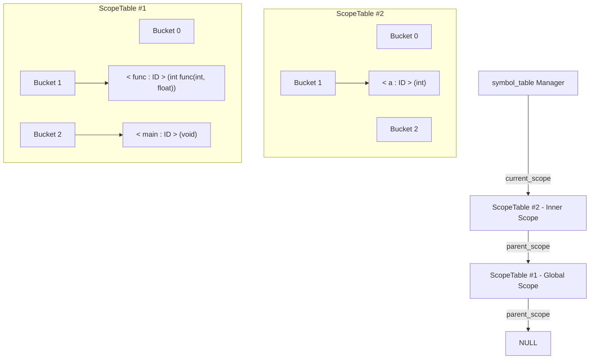

# Phase 2: Symbol Table & Scope Management

## 📖 Overview
In **Phase 2**, we implement a hierarchical, object-oriented **Symbol Table** data structure in C++ and integrate it with our Flex scanner and Bison parser.

The Symbol Table is a crucial component of any compiler:
- It tracks all identifiers (variables, arrays, functions) across nested lexical scopes (global scope, functions, conditional blocks, and loops).
- It handles identifier lookup with **scope inheritance** (searching the current scope first, then walking parent scopes up to global scope).
- It enforces scope boundaries and supports identifier shadowing (local variables shadowing global variables of the same name).

---

## 🗂️ File Structure & Description

| File Name | Description |
| :--- | :--- |
| [`symbol_info.h`](symbol_info.h) | Represents an individual identifier entry. Stores name, token type, symbol kind (`Variable`, `Array`, `Function Definition`), data type (`int`, `float`, `void`), array size, and function parameter lists. |
| [`scope_table.h`](scope_table.h) | Implements an individual scope table as a **Hash Table with Chaining** (linked lists of `symbol_info*`), maintaining a pointer to its enclosing `parent_scope`. |
| [`symbol_table.h`](symbol_table.h) | Top-level Symbol Table manager maintaining a stack/chain of `scope_table` instances, providing `enter_scope()`, `exit_scope()`, `insert()`, `lookup()`, and printing utilities. |
| [`lexical_analyzer.l`](lexical_analyzer.l) | Flex specification generating tokens for keywords, identifiers, literals, and operators. |
| [`syntax_analyzer.y`](syntax_analyzer.y) | Bison grammar integrating Symbol Table operations during syntax parsing. |
| [`InputOutput/`](InputOutput/) | Test suite containing benchmark C files (`input1.c`, `input2.c`, `input3.c`) and expected log outputs (`log1.txt`, `log2.txt`, `log3.txt`). |
| [`script.sh`](script.sh) | Automated build and run script. |
| [`Lab2_spec_Symbol table Generation.pdf`](Lab2_spec_Symbol%20table%20Generation.pdf) | Official laboratory specification document. |

---

## 🏗️ Architecture & Data Structures



### 1. `symbol_info`
Each symbol stores comprehensive metadata:
- `name`: Lexeme string (e.g., `"total"`, `"calculate"`).
- `type`: Token category (e.g., `"ID"`).
- `symbol_kind`: Category (`"Variable"`, `"Array"`, `"Function Definition"`).
- `data_type`: Return/variable data type (`"int"`, `"float"`, `"void"`).
- `param_types` & `param_names`: Vectors storing parameter signatures for functions.
- `array_size`: Dimensions for array symbols.

### 2. `scope_table`
- **Hash Table**: Fixed bucket size with separate chaining using `std::vector<std::list<symbol_info*>>`.
- **Hash Function**: Modular sum of character ASCII values:
  $$\text{hash}(s) = \left(\sum_{i=0}^{n-1} s[i]\right) \pmod{\text{bucket\_count}}$$
- **Methods**:
  - `insert_in_scope(symbol_info*)`: Inserts into the appropriate hash bucket if not already present in the current scope.
  - `lookup_in_scope(symbol_info*)`: Checks only the current scope table.
  - `delete_from_scope(symbol_info*)`: Removes a symbol from the current scope.
  - `print_scope_table(outlog)`: Formats and prints the non-empty buckets and symbol details.

### 3. `symbol_table`
- **Scope Hierarchy**: Holds a pointer `current_scope` to the most deeply nested active scope table.
- **Operations**:
  - `enter_scope()`: Increments `current_scope_id`, creates a new `scope_table` with `parent_scope = current_scope`, and updates `current_scope`.
  - `exit_scope()`: Pops the current scope, deallocates its memory, and restores `current_scope = current_scope->get_parent_scope()`.
  - `insert(symbol_info*)`: Inserts directly into `current_scope`.
  - `lookup(symbol_info*)`: Searches `current_scope`. If not found, recursively traverses `parent_scope` until found or `NULL` is reached.
  - `print_all_scopes(outlog)`: Prints all active scope tables from innermost to global scope.

---

## 🚀 How to Run

### Automated Execution
```bash
bash script.sh
```

### Manual Compilation
```bash
# Step 1: Generate parser files
yacc -d -y --debug --verbose syntax_analyzer.y

# Step 2: Compile parser
g++ -w -c -o y.o y.tab.c

# Step 3: Generate scanner
flex lexical_analyzer.l

# Step 4: Compile scanner
g++ -fpermissive -w -c -o l.o lex.yy.c

# Step 5: Link parser and scanner
g++ y.o l.o -o a.out

# Step 6: Run on test input
./a.out InputOutput/input1.c
```

---

## 📋 Sample Input & Scope Table Output

### Input Code (`InputOutput/input1.c`)
```c
int func(int a, float b) {
    return a + b;
}

void main() {
    int a, b, c, i;
    int e, f[10], g[11];
    a = 1;
    b = 2;
    c = func(a, b);
    float d;
}
```

### Generated Symbol Table (`my_log.txt`)
```text
Symbol Table

################################

ScopeTable # 1
1 --> 
< main : ID >
Function Definition
Return Type: void
Number of Parameters: 0
Parameter Details: 

8 --> 
< func : ID >
Function Definition
Return Type: int
Number of Parameters: 2
Parameter Details: int a, float b

################################
```
