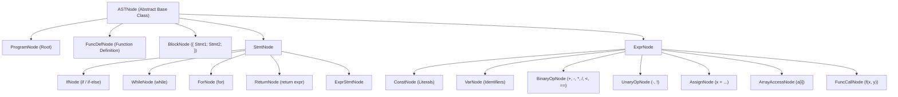

# Phase 4: Intermediate Code Generation (Two-Pass Compiler)

## 📖 Overview
In **Phase 4**, we implement a full **Two-Pass Compiler** that translates high-level C programs into machine-independent **Three-Address Code (TAC)**.

### The Two-Pass Architecture:
1. **Pass 1 (Frontend — Flex & Bison):**
   - Performs lexical, syntactic, and semantic analysis.
   - Manages scoped identifiers in the Symbol Table.
   - Constructs an in-memory **Abstract Syntax Tree (AST)** representing the hierarchical structure of the program.
2. **Pass 2 (Intermediate Code Generation):**
   - If Pass 1 detects zero errors, the driver triggers `ThreeAddrCodeGenerator`.
   - Traverses the AST nodes post-order and emits linearized Three-Address Code with temporary registers (`t0, t1, ...`) and jump labels (`L0, L1, ...`) into `code.txt`.

---

## 🗂️ File Structure & Description

| File Name | Description |
| :--- | :--- |
| [`intermediate_code_generator.y`](intermediate_code_generator.y) | Bison parser specification that constructs AST nodes during grammar reductions and drives the two-pass compilation pipeline. |
| [`lexical_analyzer.l`](lexical_analyzer.l) | Flex scanner generating tokens for identifiers, constants, types, keywords, and operators. |
| [`ast.h`](ast.h) | Complete Abstract Syntax Tree node hierarchy with code generation routines for expressions, statements, control flow, functions, and arrays. |
| [`three_addr_code.h`](three_addr_code.h) | Driver class managing TAC emission, register caching, and file streaming. |
| [`symbol_info.h`](symbol_info.h) | Symbol representation integrating with AST nodes and symbol table scopes. |
| [`scope_table.h`](scope_table.h) & [`symbol_table.h`](symbol_table.h) | Scoped symbol table implementation supporting variable and function lookups. |
| [`InputOutput/`](InputOutput/) | Test benchmark suite with sample C inputs (`input1.c`, `input2.c`, `input3.c`) and reference TAC outputs (`code1.txt`, `code2.txt`, `code3.txt`). |
| [`LAB4_COMPLETE_TUTORIAL_AND_VIVA_GUIDE.md`](LAB4_COMPLETE_TUTORIAL_AND_VIVA_GUIDE.md) | Exhaustive, step-by-step tutorial and viva revision guide covering all 15 AST tasks and key questions. |
| [`LAB4_VIVA_GUIDE.md`](LAB4_VIVA_GUIDE.md) | Quick reference cheat-sheet for Intermediate Code Generation viva. |
| [`script.sh`](script.sh) | Automated build, link, and test runner script. |
| [`Lab4-Intermediate_Code_Generation.pdf`](Lab4-Intermediate_Code_Generation.pdf) | Official laboratory specification. |

---

## 🏗️ AST Node Hierarchy & Code Generation Strategy



### 1. Register & Label Management
- **Temporaries**: Emits clean intermediate registers `t0, t1, t2, ...` using a global counter.
- **Labels**: Generates jump targets `L0, L1, L2, ...` for branching and loops.
- **Register Caching (`symbol_to_temp`)**: Avoids redundant loads of the same variable within an expression block.

### 2. Control Flow Translation
#### If-Else Branches (`IfNode`)
```text
    <evaluate condition into t0>
    if_false t0 goto L0
    <true statement branch>
    goto L1
L0:
    <else statement branch>
L1:
```

#### While Loops (`WhileNode`)
```text
L0:
    <evaluate condition into t0>
    if_false t0 goto L1
    <loop body>
    goto L0
L1:
```

### 3. Array Access & Address Scaling (`ArrayAccessNode`)
Translates $a[i]$ using 4-byte integer scaling:
```text
t0 = i * 4
t1 = a[t0]
```

### 4. Function Invocation (`FuncCallNode`)
Passes arguments via `param` instructions followed by the `call` instruction:
```text
param t0
param t1
t2 = call func, 2
```

---

## 🚀 How to Run

### Automated Execution
```bash
bash script.sh
```

### Manual Compilation
```bash
# Step 1: Generate parser C and header files
yacc -d -y --debug --verbose intermediate_code_generator.y

# Step 2: Compile parser
g++ -w -c -o y.o y.tab.c

# Step 3: Generate scanner C file
flex lexical_analyzer.l

# Step 4: Compile scanner
g++ -fpermissive -w -c -o l.o lex.yy.c

# Step 5: Link the Two-Pass Compiler
g++ y.o l.o -o two_pass_compiler

# Step 6: Execute on benchmark input
./two_pass_compiler InputOutput/input1.c

# Step 7: View generated Three-Address Code
cat code.txt
```

---

## 📋 Sample Input & Generated Three-Address Code

### Input Source (`InputOutput/input1.c`)
```c
int func(int a, int b) {
    return a + b;
}

void main() {
    int x, y, z;
    x = 10;
    y = 20;
    z = func(x, y);
    if (z > 25) {
        println(z);
    }
}
```

### Generated Three-Address Code (`code.txt`)
```text
func:
    begin_func
    t0 = a + b
    return t0
    end_func

main:
    begin_func
    x = 10
    y = 20
    param x
    param y
    t1 = call func, 2
    z = t1
    t2 = z > 25
    if_false t2 goto L0
    param z
    call println, 1
L0:
    end_func
```
