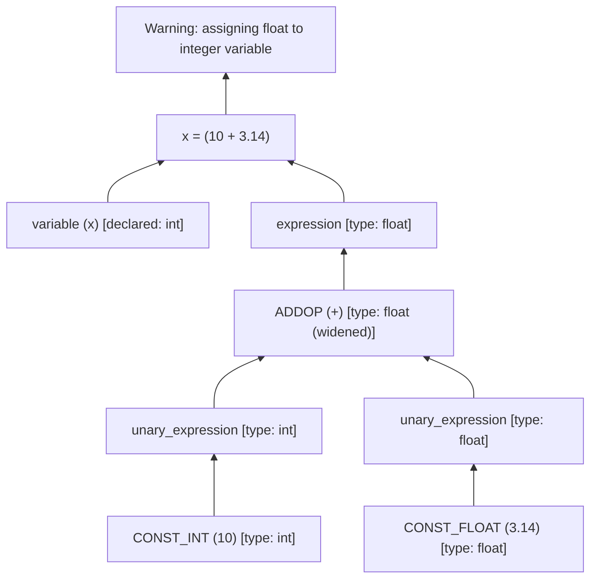

# Lab 3: Semantic Analysis & Type Checking

## 📖 Overview
In **Lab 3**, we extend our compiler frontend with a comprehensive **Semantic Analyzer** and **Type Checker**. 

While Syntax Analysis verifies that code follows valid grammatical patterns, Semantic Analysis ensures that the code has coherent meaning and conforms to the language's type system and scoping rules. The semantic analyzer traverses the parse tree, queries the Symbol Table, propagates data types, and reports meaningful compile-time semantic errors.

---

## 🗂️ File Structure & Description

| File Name | Description |
| :--- | :--- |
| [`semantic_analyzer.y`](semantic_analyzer.y) | Bison specification containing semantic validation actions, type propagation logic, and error detection rules. |
| [`lexical_analyzer.l`](lexical_analyzer.l) | Flex scanner tokenizing C source code and passing lexemes and tokens to the semantic analyzer. |
| [`symbol_info.h`](symbol_info.h) | Symbol representation containing type metadata, return type, array dimension, and function parameter vectors. |
| [`scope_table.h`](scope_table.h) | Chained hash table scope implementation with `lookup_in_scope()` for local scope inspection. |
| [`symbol_table.h`](symbol_table.h) | Hierarchical scope manager supporting nested scopes and variable shadowing. |
| [`InputOutput/`](InputOutput/) | Comprehensive test suite containing test programs with deliberate semantic errors (`input1.c`, `input2.c`) and reference logs (`log1.txt`, `error1.txt`, etc.). |
| [`viva_prep.md`](viva_prep.md) | In-depth viva preparation guide covering architectural flow, symbol table queries, and error rules. |
| [`script.sh`](script.sh) | Automated compilation and testing script. |
| [`Lab3-Semantic_Analysis.pdf`](Lab3-Semantic_Analysis.pdf) | Official laboratory specification document. |

---

## 🔍 Semantic Rules & Error Detection

The semantic analyzer enforces the following language rules:

### 1. Scope & Declaration Rules
- **Multiple Variable Declaration in Same Scope**: Uses `st->lookup_in_current_scope(id)` to prevent redeclaring an identifier in the same scope block.
- **Variable Shadowing**: Declaring an identifier with the same name in an inner nested scope (e.g., inside an `if` block or function) is legally permitted.
- **Undeclared Variable**: Any variable used in an expression or assignment must have been previously declared in the current or an ancestor scope.
- **Multiple Function Definition**: Detects duplicate function definitions and parameter name collisions within the same parameter list.

### 2. Type Checking & Expression Validation
- **Assignment Type Compatibility**:
  - Assigning `float` to `int`: Generates a `Type Mismatch: Warning - assigning float to integer variable`.
  - Incompatible type assignments: Generates an error when operands are inconsistent.
- **Void Function Usage**: Prohibits using a `void` function as an operand in expressions or right-hand side of assignments (`Void function used in expression`).
- **Modulo Operator Constraints**: Both operands of `%` must evaluate to integer type; non-integers trigger an error.

### 3. Function Call Validation
- **Undeclared Function Call**: Checks that called functions exist in the symbol table with kind `"Function Definition"`.
- **Argument Count Mismatch**: Verifies that the number of arguments supplied in `func(a, b, ...)` matches the function's declaration.
- **Argument Type Mismatch**: Compares each passed argument's type against the formal parameter types stored in the function's symbol table entry.

### 4. Array Access Validation
- **Integer Indexing**: Array subscripts `a[i]` must evaluate to `int`. Using a `float` or `void` expression as an index throws an error.
- **Array as Scalar**: Using an array symbol without subscripts in an arithmetic expression triggers an error.
- **Scalar as Array**: Subscripting a non-array variable (e.g., `x[0]` where `int x`) triggers an error.

---

## 🌳 Type Propagation Mechanism

Every grammar reduction passes a `symbol_info*` pointer up the parse tree (`$$`). Types are propagated bottom-up:


---

## 🚀 How to Run

### Automated Execution
```bash
bash script.sh
```

### Manual Compilation
```bash
# Step 1: Generate parser files
yacc -d -y --debug --verbose semantic_analyzer.y

# Step 2: Compile parser
g++ -w -c -o y.o y.tab.c

# Step 3: Generate scanner
flex lexical_analyzer.l

# Step 4: Compile scanner
g++ -fpermissive -w -c -o l.o lex.yy.c

# Step 5: Link parser and scanner
g++ y.o l.o -o a.out

# Step 6: Run on test input
./a.out InputOutput/input1.c

# Step 7: Inspect output logs and error report
cat error.txt
```

---

## 📋 Sample Input & Diagnostic Errors

### Test Input (`InputOutput/input1.c`)
```c
int func(int a, int b) {
    return a + b;
}

void main() {
    int x, y;
    float z;
    int arr[10];

    x = func(x);        // Error: Argument count mismatch
    y = z;              // Warning: Assigning float to int
    arr[z] = 5;         // Error: Array index not an integer
    x = non_existent;   // Error: Undeclared variable
}
```

### Diagnostic Output (`error.txt`)
```text
At line no: 10 Total number of arguments mismatch in function func

At line no: 11 Type Mismatch: Warning - assigning float to integer variable

At line no: 12 Array index is not an integer

At line no: 13 Undeclared variable non_existent

Total errors: 4
```
