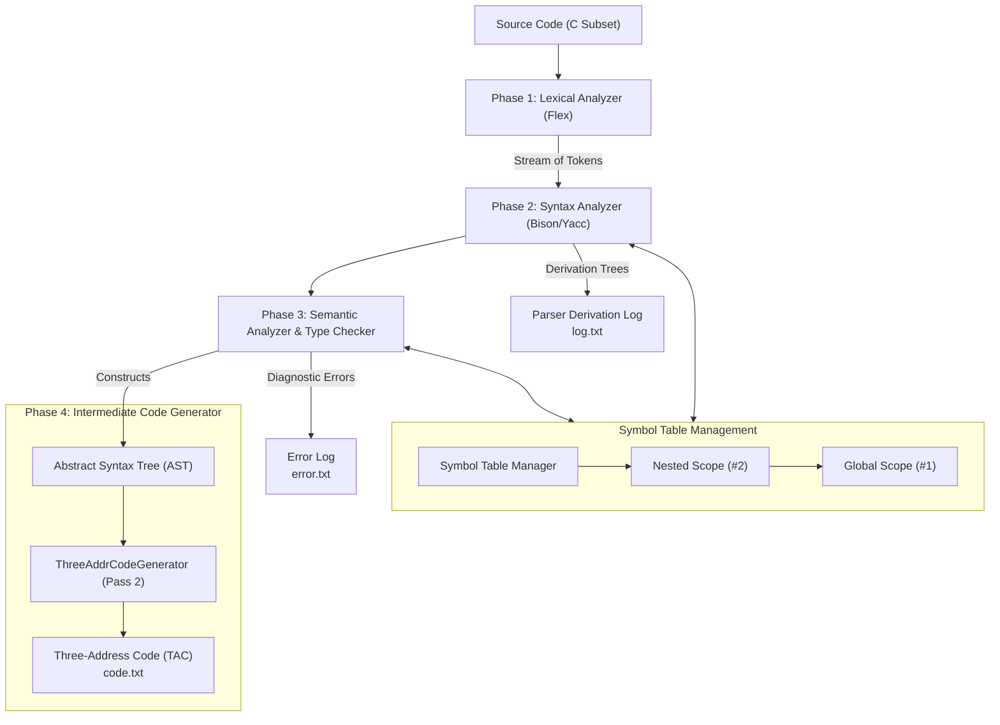

# Compiler Design — CSE420 Laboratory Projects

[](https://isocpp.org/)
[](https://github.com/westes/flex)
[](https://www.gnu.org/software/bison/)
[](#)
[](#)

This repository contains the end-to-end implementation of a **C Compiler Frontend and Intermediate Code Generator** developed for **CSE420: Compiler Design**.

Organized by actual compiler design phases, this project covers the entire compiler pipeline from raw lexical scanning and context-free grammar parsing to hierarchical symbol tables, compile-time semantic analysis, and two-pass Three-Address Code (TAC) generation.

---

## 🏛️ Compiler Pipeline Architecture



---

## 🗂️ Compiler Phases Breakdown

| Phase Directory | Compiler Design Step | Core Technologies | Primary Input / Output | Documentation |
| :--- | :--- | :--- | :--- | :--- |
| **[`01-Lexical-and-Syntax-Analysis`](01-Lexical-and-Syntax-Analysis/)** | **Lexical & Syntax Analysis (Scanning & Parsing)** | Flex, Bison (Yacc), C++ | `input.txt` $\to$ `log.txt` (Derivations) | [Phase 1 Guide](01-Lexical-and-Syntax-Analysis/README.md) |
| **[`02-Symbol-Table-Management`](02-Symbol-Table-Management/)** | **Symbol Table & Hierarchical Scoping** | C++, Chained Hash Tables | `input1.c` $\to$ `my_log.txt` (Scope Tables) | [Phase 2 Guide](02-Symbol-Table-Management/README.md) |
| **[`03-Semantic-Analysis`](03-Semantic-Analysis/)** | **Semantic Analysis & Type Checking** | Bison, Flex, Scoped Symbol Table | `input1.c` $\to$ `error.txt` & `log.txt` | [Phase 3 Guide](03-Semantic-Analysis/README.md) |
| **[`04-Intermediate-Code-Generation`](04-Intermediate-Code-Generation/)** | **Intermediate Code Generation (Two-Pass TAC)** | Two-Pass Compiler, AST, TAC | `input1.c` $\to$ `code.txt` (3-Address Code) | [Phase 4 Guide](04-Intermediate-Code-Generation/README.md) |

---

## 🔬 Deep Dive: Compiler Phases

### 🔹 [01. Lexical & Syntax Analysis](01-Lexical-and-Syntax-Analysis/)
- **Scanner (`lexical_analyzer.l`)**: Uses regular expressions in Flex to tokenize C keywords (`if`, `else`, `for`, `while`, `int`, `float`, `void`, `return`, `println`), numeric constants (integers, floating-point with exponents), identifiers, operators, and delimiters while tracking line numbers.
- **Parser (`syntax_analyzer.y`)**: Validates the token stream against Context-Free Grammar (CFG) rules in Bison, handles operator precedence, resolves the classic dangling-else ambiguity, and logs grammar reductions step-by-step.
- **Data Structure**: `symbol_info` for lexeme encapsulation.

### 🔹 [02. Symbol Table & Scope Management](02-Symbol-Table-Management/)
- **Scope Hierarchy**: Implements nested lexical scopes via a stack of `scope_table` instances (`parent_scope` linkage).
- **Fast Lookup**: Each `scope_table` uses a Hash Table with separate chaining (`std::vector<std::list<symbol_info*>>`) and polynomial string hashing.
- **Scope Operations**:
  - `enter_scope()`: Creates a new child scope table upon encountering a block `{`.
  - `exit_scope()`: Pops and deletes the current scope table upon leaving `}`.
  - `insert()`: Adds symbol into current scope, preventing intra-scope duplicates.
  - `lookup()`: Searches locally, then traverses upward through parent scopes to global scope.

### 🔹 [03. Semantic Analysis & Type Checking](03-Semantic-Analysis/)
- **Static Semantic Validation**: Traverses parse derivations, queries the Symbol Table, and intercepts invalid C code:
  - Multiple variable declarations in the same scope (while preserving valid variable shadowing across outer/inner scopes).
  - Use of undeclared variables or undefined functions.
  - Function argument count and parameter type mismatches.
  - Type checking in assignment statements (warns on float-to-int narrowing).
  - Array indexing checks (subscripts must evaluate strictly to integer).
  - Misuse of `void` function return values in arithmetic/relational expressions.
  - Modulo operator operand constraints (both operands must be integer).
- **Viva Preparation**: Includes [`viva_prep.md`](03-Semantic-Analysis/viva_prep.md) summarizing core architectural Q&A.

### 🔹 [04. Intermediate Code Generation (Two-Pass Compiler)](04-Intermediate-Code-Generation/)
- **Two-Pass Compiler Architecture**:
  - **Pass 1 (Flex & Bison)**: Validates syntax/semantics and dynamically constructs a polymorphic **Abstract Syntax Tree (AST)** using an object-oriented node hierarchy (`ProgramNode`, `FuncDefNode`, `BlockNode`, `IfNode`, `WhileNode`, `ForNode`, `AssignNode`, `BinaryOpNode`, `ArrayAccessNode`, etc.).
  - **Pass 2 (`ThreeAddrCodeGenerator`)**: Only executes when Pass 1 reports zero errors. Recursively traverses the AST post-order to generate clean **Three-Address Code (TAC)**.
- **Key Code Generation Features**:
  - **Temporary Management**: Emits linearized registers (`t0, t1, t2, ...`).
  - **Branching & Loops**: Generates jump labels (`L0, L1, ...`) and conditional jumps (`if_false t0 goto L0`).
  - **Array Access**: Byte-offset address calculation ($4 \times \text{index}$).
  - **Register Caching**: Avoids redundant variable reloads.
- **Viva Guides**: Complete tutorial and question bank in [`LAB4_COMPLETE_TUTORIAL_AND_VIVA_GUIDE.md`](04-Intermediate-Code-Generation/LAB4_COMPLETE_TUTORIAL_AND_VIVA_GUIDE.md).

---

## 🛠️ Prerequisites & Environment Setup

### Required Tools
- **GCC / G++** ($\ge$ 7.0)
- **Flex** (Fast Lexical Analyzer Generator)
- **Bison** / **Yacc** (Parser Generator)
- **Bash Shell** (Linux, macOS, WSL, or Git Bash for Windows)

### Installing Prerequisites

#### On Windows
- **Via MSYS2 (Recommended):**
  ```powershell
  pacman -S mingw-w64-x86_64-gcc mingw-w64-x86_64-flex mingw-w64-x86_64-bison make
  ```
- **Via WSL (Ubuntu):**
  ```bash
  sudo apt update && sudo apt install -y build-essential flex bison
  ```

#### On Linux (Ubuntu / Debian)
```bash
sudo apt update
sudo apt install -y build-essential flex bison
```

#### On macOS
```bash
brew install flex bison gcc
```

---

## ⚡ Quick Start: Running Any Phase

Every phase folder includes an automated shell script `script.sh` that cleans, builds, links, and runs on sample inputs:

```bash
# Phase 1: Lexical & Syntax Analysis
cd 01-Lexical-and-Syntax-Analysis
bash script.sh

# Phase 2: Symbol Table Management
cd ../02-Symbol-Table-Management
bash script.sh

# Phase 3: Semantic Analysis & Type Checking
cd ../03-Semantic-Analysis
bash script.sh

# Phase 4: Intermediate Code Generator (Two-Pass Compiler)
cd ../04-Intermediate-Code-Generation
bash script.sh
```

---

## 📂 Repository File Tree

```text
Compiler-design/
├── .gitignore
├── README.md                                          # Master repository documentation
├── 01-Lexical-and-Syntax-Analysis/                    # Phase 1: Scanning & Parsing
│   ├── README.md
│   ├── lexical_analyzer.l
│   ├── syntax_analyzer.y
│   ├── symbol_info.h
│   ├── input.txt
│   ├── script.sh
│   └── *.pdf                                          # Phase specification and grammar reference
├── 02-Symbol-Table-Management/                        # Phase 2: Hierarchical Symbol Table
│   ├── README.md
│   ├── lexical_analyzer.l
│   ├── syntax_analyzer.y
│   ├── symbol_info.h
│   ├── scope_table.h
│   ├── symbol_table.h
│   ├── script.sh
│   ├── InputOutput/                                   # Benchmark tests & reference logs
│   └── *.pdf
├── 03-Semantic-Analysis/                              # Phase 3: Semantic Validation & Type Checking
│   ├── README.md
│   ├── viva_prep.md                                   # Comprehensive viva revision guide
│   ├── lexical_analyzer.l
│   ├── semantic_analyzer.y
│   ├── symbol_info.h
│   ├── scope_table.h
│   ├── symbol_table.h
│   ├── input.c
│   ├── script.sh
│   ├── InputOutput/                                   # Test suite with semantic error benchmarks
│   └── *.pdf
└── 04-Intermediate-Code-Generation/                   # Phase 4: Two-Pass Compiler & Three-Address Code
    ├── README.md
    ├── LAB4_COMPLETE_TUTORIAL_AND_VIVA_GUIDE.md       # Exhaustive viva guide & tutorial
    ├── LAB4_VIVA_GUIDE.md                             # Quick viva cheat sheet
    ├── lexical_analyzer.l
    ├── intermediate_code_generator.y
    ├── ast.h                                          # AST node classes & TAC logic
    ├── three_addr_code.h                              # Code generation driver
    ├── symbol_info.h
    ├── scope_table.h
    ├── symbol_table.h
    ├── script.sh
    ├── InputOutput/                                   # Benchmark inputs & reference TAC outputs
    └── *.pdf
```

---
